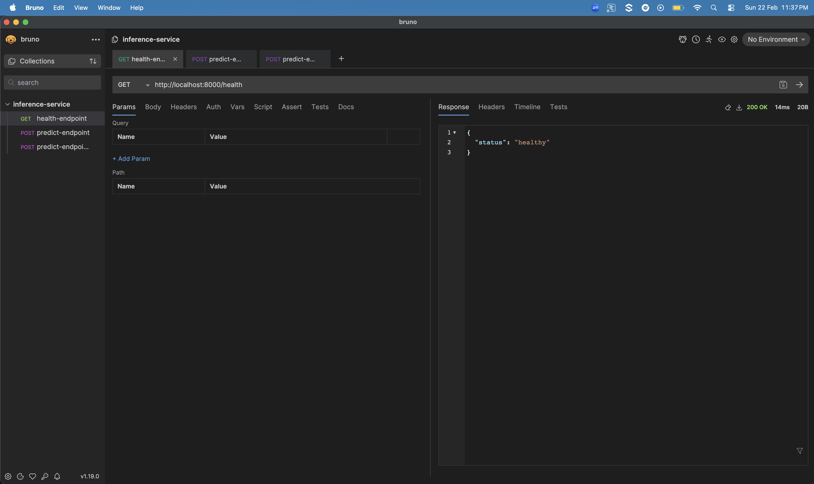
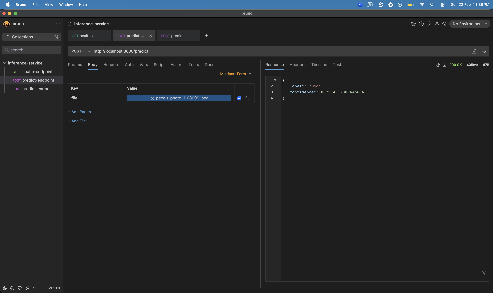

# MLOps Assignment 2: Binary Image Classification

# Group No: 78
**Group Member Names:**
* VENKATARAMANAN S (2024AA05555) 100%
* PRANAV DEWANGAN (2024AA05554) 100%

## Repository URL: 
https://github.com/VenkataramananSelvaraju/binary-image-classification

## 1. Project Overview
This project implements a full-stack MLOps pipeline for a Pet image classification service. It covers the entire lifecycle from local training to containerized deployment, automated testing, and production monitoring.

### MLOps Lifecycle Overview

| Stage | Requirement | Implementation |
| :--- | :--- | :--- |
| **M1** | Data/Model Versioning | Tracked via DVC to manage large `.h5` model files. |
| **M2** | Containerization | `Dockerfile` for environment consistency. |
| **M3** | CI/CD Pipeline | **GitHub Actions** automating testing, build, and deployment. |
| **M4** | Orchestration | **Kubernetes (Minikube)** for local production-like scaling. |
| **M5** | Monitoring/Logging | FastAPI Middleware for latency & `BackgroundTasks` for data tracking.

### Prerequisites
- Docker
- Minikube
- Python 3.12+
- DVC
- Git-LFS

## 2. Setup & Installation
To reproduce this project locally:
1. Clone the repository: `git clone <repo-url>`
2. Create a Virtual Environment :
```bash
python -m venv venv
# Windows
venv\Scripts\activate
# Mac/Linux
source venv/bin/activate
```
3. Install dependencies: `pip install -r requirements.txt`
4. Run Data Loader: `python src/download_data.py`
5. Run Train Model: `python src/train.py`

## 3. Environment Setup
```bash
# Build the container
docker build -t pet-classifier:latest .
```

## 4. Running Local Deployment
```bash
# Start Minikube cluster
minikube start
eval $(minikube docker-env)

# Deploy to K8s
kubectl apply -f k8s/
```

## 5. Monitoring & Smoke Testing
We utilize custom FastAPI middleware to track latency and BackgroundTasks to log predictions.
```bash
# Run post-deploy smoke test
python tests/smoke_test.py
```

## CI/CD Pipeline
Every git push triggers the following automated workflow:

1. **Test Stage:** Runs `pytest`.
2. **Build Stage:** Builds the Docker image and pushes to Docker Hub.
3. **Deploy Stage:** Updates the Kubernetes deployment.
4. **Validation Stage:** Executes `smoke_test.py` to verify the live service.

### Screen Recording: 
https://drive.google.com/drive/folders/1ePZB6iINMV9hWFEe3bfXE6jq-gXmgx2S?usp=drive_link

### Screenshots


